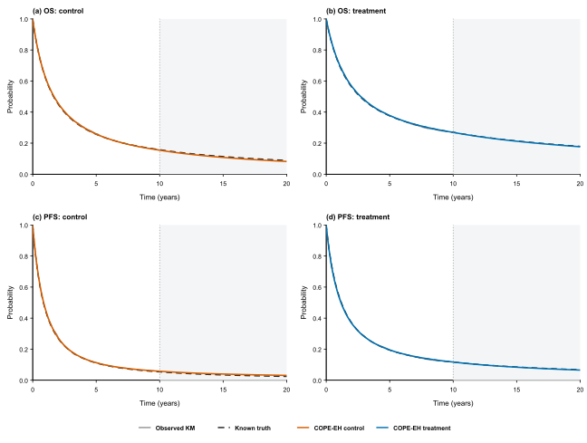
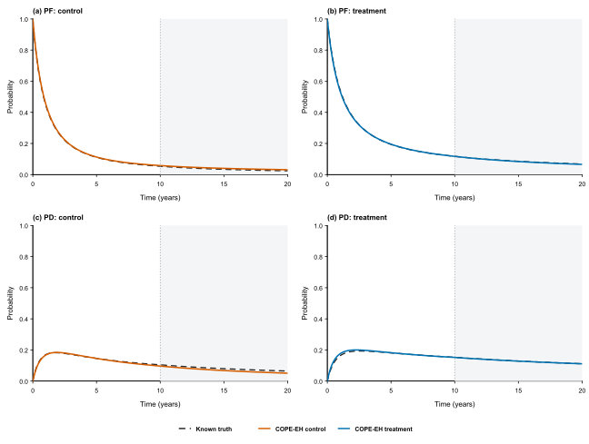

# copeEH

Coherent population-mortality-adjusted extrapolation of marginal overall
survival (OS) and progression-free survival (PFS).

## Installation

Download [source (.tar.gz)](https://github.com/haohaostats/copeEH/releases/download/v1.0.0/copeEH_1.0.0.tar.gz) or [Windows binary (.zip)](https://github.com/haohaostats/copeEH/releases/download/v1.0.0/copeEH_1.0.0.zip) from the [v1.0.0 release](https://github.com/haohaostats/copeEH/releases/tag/v1.0.0).


```r
install.packages("copeEH_1.0.0.tar.gz", repos = NULL, type = "source")
library(copeEH)
```

On Windows use the binary archive with type = "win.binary" if desired:

```r
install.packages("copeEH_1.0.0.zip", repos = NULL, type = "win.binary")
```

## Fit and predict

```r
d <- cope_example()
fit <- fit_cope(d$os, d$pfs, population = d$population)
summary(fit)
coef(fit)
p <- predict(fit, times = seq(0, 20, by = 0.1))
plot(fit, type = "survival")
plot(fit, type = "state")
state_outcomes(fit, horizon = 20, annual_cost_pf = 20000,
               annual_cost_pd = 100000)
```

## Fixed teaching dataset with known truth

```r
data(cope_demo)
result <- run_cope_demo()
result$accuracy
result$outcomes
result$economic
plot(result)
plot(result, type = "state")
```

In this example, extrapolation MIAE ranges from 0.0014 to 0.0060 and both arm-level
QALY errors are below 0.15%. The control PD-time error is about -6.1% and the
incremental ICER error is about +7.2%; all quantities are returned for inspection.

Fit each treatment arm separately. Each endpoint needs time and status (1 for
event, 0 for right censoring). PFS events include progression or death.
Use years for fitting if using the economic-outcome helpers.


## Example results

These are actual outputs from the fixed dataset and the shipped code. All outcome rows are shown, including larger errors. Observed follow-up is 0–10 years; extrapolation is 10–20 years.

### Survival curves



### Health-state probabilities



### Curve accuracy

| Arm | Endpoint | Interval | MIAE | Maximum absolute error |
|---|---|---|---:|---:|
| control | OS | observed | 0.00281 | 0.00570 |
| control | OS | extrapolated | 0.00563 | 0.00684 |
| control | PFS | observed | 0.00327 | 0.00772 |
| control | PFS | extrapolated | 0.00598 | 0.00690 |
| treatment | OS | observed | 0.00261 | 0.00605 |
| treatment | OS | extrapolated | 0.00189 | 0.00254 |
| treatment | PFS | observed | 0.00180 | 0.00811 |
| treatment | PFS | extrapolated | 0.00142 | 0.00237 |

[Download full-precision CSV](docs/results/curve_accuracy.csv)

### State times, life-years and QALYs

| Arm | Outcome | Truth | Estimate | Signed error | Relative error (%) |
|---|---|---:|---:|---:|---:|
| control | pf_years | 2.2557 | 2.3481 | 0.0925 | 4.10 |
| control | pd_years | 2.2131 | 2.0787 | -0.1344 | -6.07 |
| control | life_years | 4.4687 | 4.4268 | -0.0419 | -0.94 |
| control | qaly | 2.7326 | 2.7288 | -0.0039 | -0.14 |
| control | state_cost | 215108.60 | 207630.18 | -7478.41 | -3.48 |
| treatment | pf_years | 3.5780 | 3.5559 | -0.0222 | -0.62 |
| treatment | pd_years | 2.9834 | 3.0115 | 0.0281 | 0.94 |
| treatment | life_years | 6.5614 | 6.5674 | 0.0060 | 0.09 |
| treatment | qaly | 3.9174 | 3.9220 | 0.0046 | 0.12 |
| treatment | state_cost | 290488.82 | 292970.16 | 2481.34 | 0.85 |

PF, PD and life-years are restricted to 20 years and undiscounted. QALYs and state costs use 3% annual discounting.

[Download full-precision CSV](docs/results/outcome_accuracy.csv)

### Incremental economic outcomes

| Result | Incremental LY | Incremental QALY | Incremental cost | ICER | INMB |
|---|---:|---:|---:|---:|---:|
| truth | 2.0927 | 1.1847 | 125380.22 | 105829.54 | -6906.47 |
| estimate | 2.1406 | 1.1932 | 135339.98 | 113422.32 | -16016.04 |

Willingness-to-pay is 100,000 currency units/QALY with 50,000 additional discounted incremental cost. Both truth and estimate indicate more benefit and more cost; both INMB values are negative at this threshold. The proximity to the threshold magnifies relative INMB differences. Neither ICER nor INMB is an accuracy guarantee for other applications.

[Download full-precision CSV](docs/results/economic_comparison.csv)

### Regenerate the displayed results

With the package installed, run from the repository root:

```text
Rscript tools/render_demo.R
```

This reanalyses the fixed data and writes the CSV, PDF, SVG and PNG files. It does not simulate new data or reproduce the paper's experiments.

## Population mortality

Supply consistent vectorised survival(t) and hazard(t) functions or use:

```r
pop <- population_mortality(breaks = c(0, 5, 10),
                            hazard = c(0.012, 0.018, 0.03))
```

The last rate continues indefinitely. Real applications must construct an
appropriate population process using age, sex and calendar-year information.
The helper does not download life tables or automatically standardise cohorts.

## Statistical scope

This is a jointly constrained marginal model, not an identified patient-level
event-history or transition-hazard model. The default degree is 3 and eta is 2;
the main specification has a free relative-survival tail. These choices remain
explicit and are not selected using unobserved outcomes.

The working-independence objective cannot recover missing OS/PFS dependence.
Public methods return point estimates only. Internal inverse Hessians are
working-likelihood diagnostics, not validated joint sampling covariance.
Confidence intervals, PSA and automatic model selection are not provided.

Economic helpers integrate PF/PD state costs only. Drug, administration,
subsequent-treatment, adverse-event and terminal costs require separate inputs.
All costs must use a common currency and all times a common scale.

## Documentation

Use help(package = "copeEH") for function documentation. The installed
tutorial can be located using:

```r
system.file("doc", "getting-started.md", package = "copeEH")
```

R scripts contain no text comments. Explanations are in independent help files
and the tutorial. Only the method package is included; the paper reproduction
project, competing methods and clinical datasets are not bundled.

## Development

```text
R CMD build copeEH
R CMD check --no-manual copeEH_1.0.0.tar.gz
```

The package tests use synthetic data and run with base R. The core estimation
and prediction routines preserve the research implementation, while the public
interface adds input checks and stores population functions for reuse.
